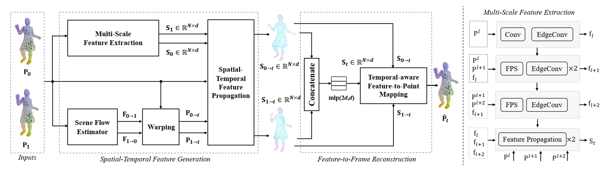
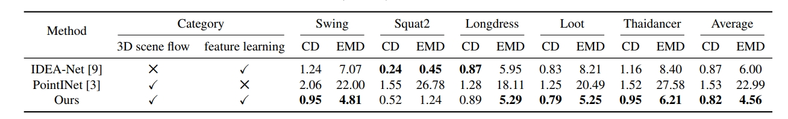
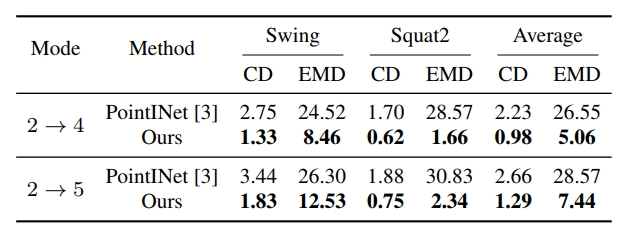
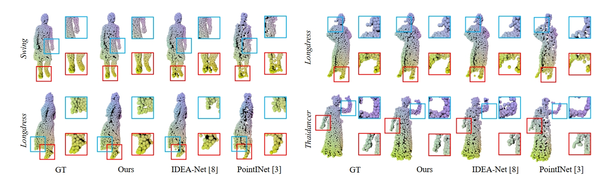

# STE_PCI
This repository contains Pytorch implementation of **Learning Spatial-Temporal Embeddings for Sequential Point Cloud Frame Interpolation** (ICIP2023)

# Cite this work
```
@inproceedings{zhao2023learning,
  title={Learning Spatial-Temporal Embeddings for Sequential Point Cloud Frame Interpolation},
  author={Zhao, Lili and Sun, Zhuoqun and Ren, Lancao and Yin, Qian and Yang, Lei and Guo, Meng},
  booktitle={2023 IEEE International Conference on Image Processing (ICIP)},
  pages={810--814},
  year={2023},
  organization={IEEE}
}
```
On-line Paper: [[Paper](https://ieeexplore.ieee.org/document/10221958)]

## Introduction
 
In this paper, a novel frame interpolation network is proposed, which jointly exploits the spatial features and flows. The key success of our method lies in the developed **spatial-temporal feature propagation module** and **temporal-aware feature-to-point mapping module.** The former effectively embeds the spatial features and scene flows into a spatial-temporal feature representation (STFR). The latter generates a much improved target frame from STFR.

## Results
We compared our model with [PointINet](https://www.engineeringvillage.com/app/doc/?docid=cpx_32d64213180f209ab7cM76fe10178163134&pageSize=25&index=1&searchId=9beda5bd86214bb1a5cc12b1f41269ff&resultsCount=2&usageZone=resultslist&usageOrigin=searchresults&searchType=Quick) and [IDEA-Net](https://ieeexplore.ieee.org/document/9880149) on CD and EMD.
<div align="center">

</div>

<div align="center">

</div>

## Qualitative comparisons
Our method can interpolate frames presented with more coherent motion and better local structural details, such as human feet, hair and hands.
<div align="center">

</div>

## Usage
### Requirements
Our code is developed and tested on the following environment:

* Python 3.7
* PyTorch 1.7.0
* Cuda 10.1
* Numpy 1.19

And we utilized open source pointnet2 to implement our code: [Pointnet2](https://github.com/sshaoshuai/Pointnet2.PyTorch/issues)

### Dataset

We processed the point cloud sequences of [MITAMA dataset](https://ieeexplore.ieee.org/document/9880149) and [MPEG-PCC](https://mpeg-pcc.org/index.php/pcc-content-database/) and [8i Lab](http://plenodb.jpeg.org/pc/8ilabs/) to obtain the [dataset](https://pan.baidu.com/s/1TndzM3W2ZAFp8bH0E_5QzA?pwd=zfym) for training and testing of our model.

### Train
Our model training process can be divided into two steps: Initial training on MITAMA dataset and finetuning on 8IVSLF dataset.

To train on **MITAMA** dataset, please set the parameters(train_root, npoints, save_dir, etc.) and run train.py

To finetune on **8IVSLF** dataset, please set the parameters(train_root, npoints, save_dir, etc.) and run finetune.py

### Inference
We provide our pretrained model for inference. 

To evaluate a pre-trained SR-Net on MITAMA dataset with single GPU, run:
```[python]
python test.py --test_root path\to\testdataset --.\model_trained\model_for_MITAMA.pth 
```
To evaluate a pre-trained SR-Net on 8IVSLF dataset with single GPU, run:
```[python]
python test.py --test_root path\to\testdataset --.\model_trained\model_for_8IVSLF.pth
```


